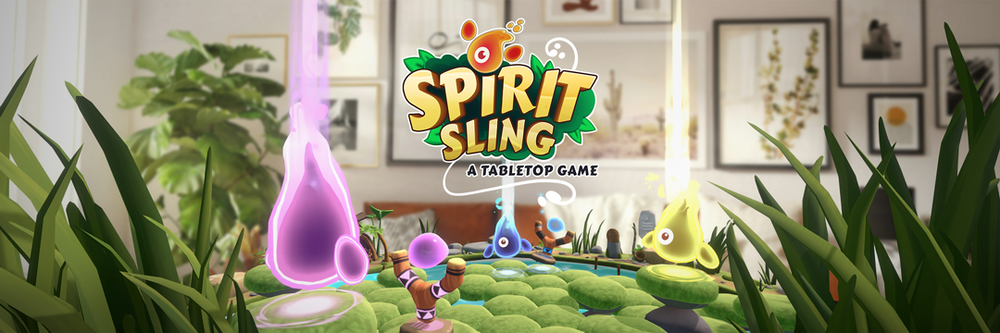
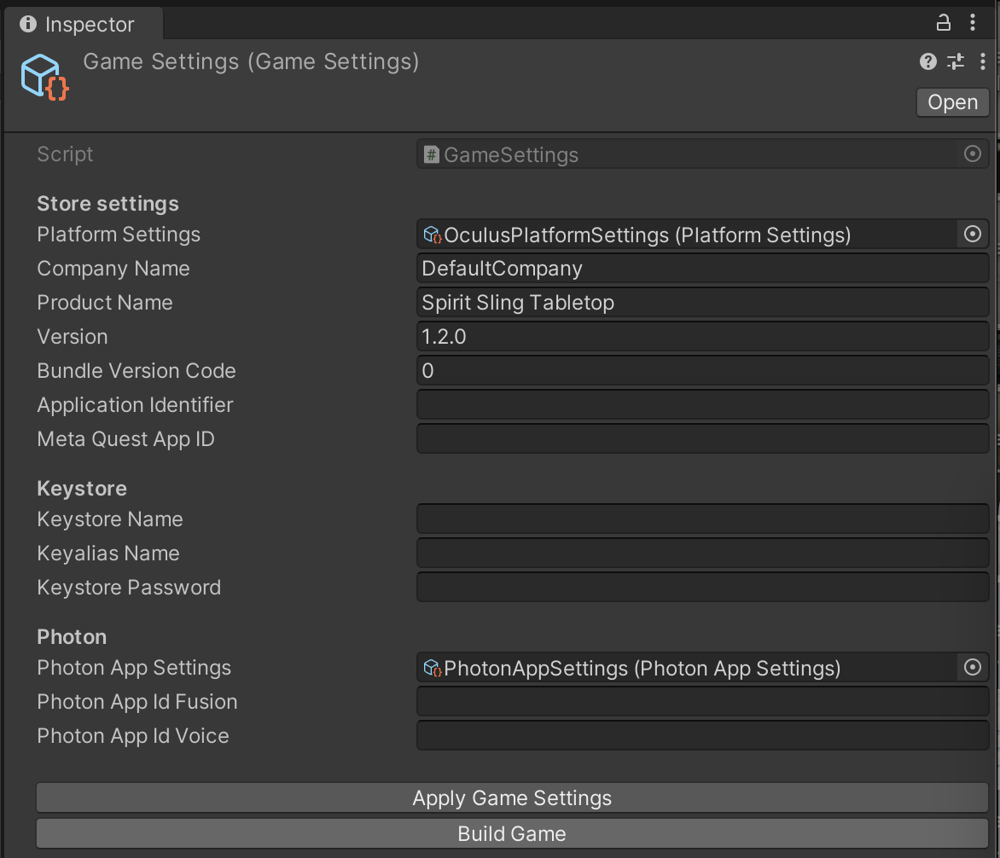

# Spirit Sling Tabletop
Spirit Sling is a social mixed reality (MR) app created to show developers how to build exciting tabletop games that give users a reason to be together in MR. With Meta's new and improved Avatars, and the power of mixed reality, users can now place a fun tabletop experience on a surface and invite a friend into their space to play with them.

This codebase is available as both a reference and template for mixed reality projects. You can also test the game on the [Meta Horizon Store](https://www.meta.com/en-gb/experiences/spirit-sling-tabletop/26801347429479910/).

# Mechanics and Features
Discover some of the mechanics, features, and techniques used to deliver this unique and engaging multiplayer experience. For more information, visit the [documentation](https://developers.meta.com/horizon/documentation/unity/spirit-sling/).

- [Contextual game board placement](https://developers.meta.com/horizon/documentation/unity/spirit-sling/#contextual-board-placement-mixed-reality-utility-kit--other-tips): Using Scene API and MRUK, Spirit Sling accesses real-world object data to ensure that the game board is immediately accessible to users’ hands and maintains visibility above real-world objects.
- [Creating and joining a multiplayer session](https://developers.meta.com/horizon/documentation/unity/spirit-sling/#creating-a-multiplayer-session): Spirit Sling supports players joining public or private multiplayer sessions. After the Platform SDK is initialized, the app creates a public or private multiplayer room by calling Fusion.NetworkRunner.StartGame(...) or GroupPresence.Set(...), respectively. A public session is joined by first subscribing to the NetworkEvents.OnSessionListUpdate event, then NetworkRunner.JoinSessionLobby(...)and finally finding and joining the first non-full public room calling NetworkRunner.StartGame(...). For a private lobby, the app reads ApplicationLifecycle.GetLaunchDetails() to accept the invite. The app also subscribes to the ApplicationLifecycle.SetLaunchIntentChangedNotificationCallback() callback to listen for the launch intent changes.
- [Hand tracking integration](https://developers.meta.com/horizon/documentation/unity/spirit-sling/#intractable-virtual-objects-using-isdk-and-physics-to-enhance-gameplay): Spirit Sling supports hand tracking as a primary form of input when users interact with the gameboard. Hand tracking and Grab interactions can be integrated using Interaction SDK through the Building Blocks tool.
- [Using Interaction SDK to control gameplay](https://developers.meta.com/horizon/documentation/unity/spirit-sling/#using-isdk-to-control-gameplay-elements): Users can control and manipulate gameplay elements through the app’s ability to detect grab gestures using the Grabbable,HandGrabInteractable, and GrabInteractable components.
- [Game board adjustment with hand tracking](https://developers.meta.com/horizon/documentation/unity/spirit-sling/#manual-board-adjustment-with-hand-tracking): To support an adaptable and comfortable user experience, the game enables users to re-adjust the board after initial placement using the Grabbable component from ISDK and custom One/TwoGrabGameVolumeTransformer components.
- [Adding hand interactions to interface buttons](https://developers.meta.com/horizon/documentation/unity/spirit-sling/#adding-hand-interaction-to-interface-buttons): Users can leverage the poke interaction to navigate the game’s user interface. Poke interaction support can be enabled by adding the Poke Interaction building block, creating a SpiritSlingButton script and attaching it to a game object that includes the PokeInteractable component.

## How to run the project in Unity
1. [Configure the project](./Documentation/ProjectConfiguration.md) with Meta Quest and Photon
2. Make sure you're using Unity 2022.3.52.
3. Make sure you're using one of these devices: Meta Quest 3S, Meta Quest 3, Meta Quest Pro.
4. Locate the '[Assets/GameSettings.asset](./Assets/GameSettings.asset)' file and populate all the empty fields with your own data.  
4.1. **Application Identifier** is the unique string that identifies your app on Meta Quest Store.  
4.2. **Meta Quest App ID** is the ID of your app on Meta Quest Store.  
4.3. Optional: populate **Android Keystore** name and password. Make sure not to store the 'Assets/GameSettings.asset' file in VCS in this case.  
4.4. **Photon App Id Fusion / Voice**: unique ids obtained in step 1 in the '[Photon Configuration](./Documentation/ProjectConfiguration.md#photon-configuration)' section.


## Project Structure
The project is organically structured to distinguish the main components of the MR experience's logic. Main Spirit Sling components:
- **[ConnectionManager](Assets/SpiritSling/Common/Networking/Scripts/ConnectionManager.cs)** handles the Photon Fusion connection workflows for single and multiplayer sessions. The PhotonConnector logic showcases how a shared multiplayer session is handled via Photon Fusion, how the creation of shared rooms and lobbies work, and how the connection states can be handled accordingly.
- **[GameVolumeSpawner](Assets/SpiritSling/TableTop/GameVolume/Scripts/GameVolumeSpawner.cs)** handles logic for placing the game board into physical environment. It also ensures that the game board is accessible by hands so the user can readjust the initial placement for a more comfortable experience.
- **[TabletopGameStateMachine](Assets/SpiritSling/TableTop/Gameplay/Scripts/Tabletop/TabletopGameStateMachine.cs)** controls the flow of the game between different gameplay states.
- Please visit the [Meta Horizon Documentation](https://developers.meta.com/horizon/documentation/unity/spirit-sling/#intractable-virtual-objects-using-isdk-and-physics-to-enhance-gameplay) page for more details on how the game uses Mixed Reality Utility Kit (MRUK), Platform SDK and Meta Interaction SDK (ISDK).

# Dependencies
This project makes use of the following plugins and software:
- [Mixed Reality Utility Kit v74.0.1](https://developers.meta.com/horizon/documentation/unity/unity-mr-utility-kit-overview/)
- [Meta XR Core SDK v74.0.1](https://developers.meta.com/horizon/downloads/package/meta-xr-core-sdk)
- [Meta Interaction SDK v74.0.1](https://developers.meta.com/horizon/documentation/unity/unity-isdk-interaction-sdk-overview/)
- [Meta Avatars SDK v31.0.0](https://developers.meta.com/horizon/documentation/unity/meta-avatars-overview/)
- [Photon Fusion](https://doc.photonengine.com/fusion/current/getting-started/fusion-intro)

# Getting the code

First, ensure you have Git LFS installed by running this command:

```sh
git lfs install
```

Then, clone this repo using the "Code" button above, or this command:

```sh
git clone https://github.com/oculus-samples/Unity-SpiritSling.git
```

# License
The majority of Spirit Sling is licensed under [MIT LICENSE](./LICENSE), however files from [Text Mesh Pro](http://www.unity3d.com/legal/licenses/Unity_Companion_License), and [Photon SDK](./Assets/Photon/LICENSE), are licensed under their respective licensing terms.

# Contribution
See the [CONTRIBUTING](./CONTRIBUTING.md) file for how to help out.
